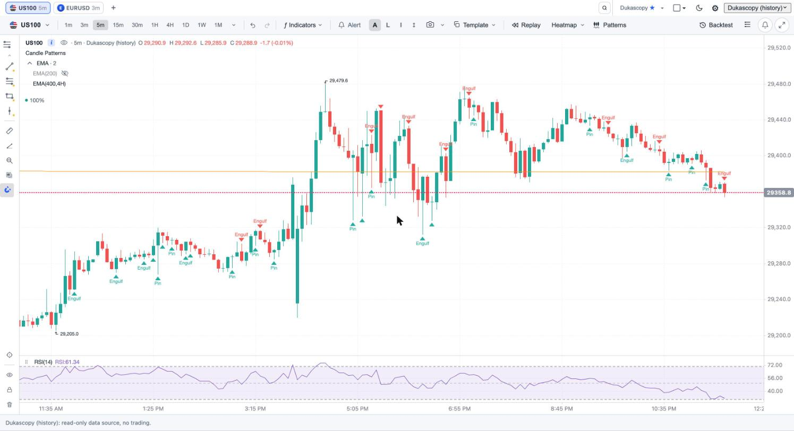
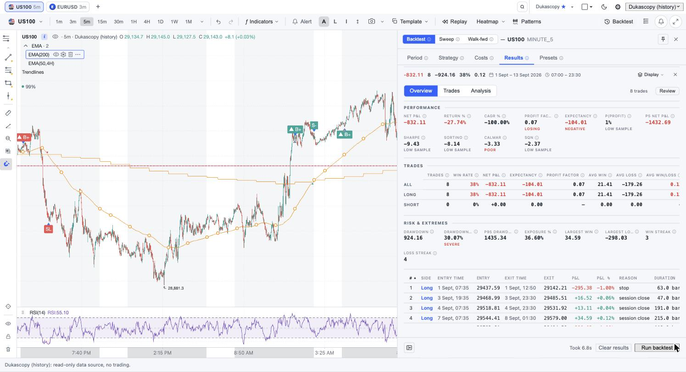
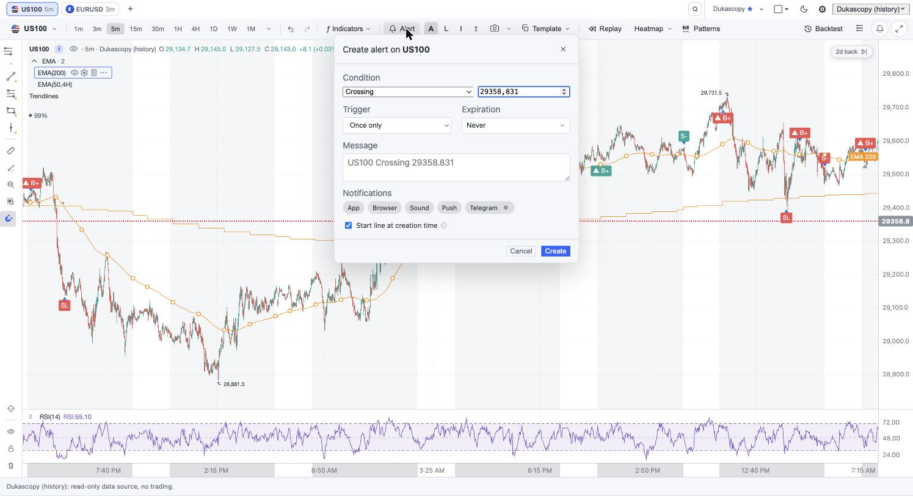

# auto_trader

An intraday trading app with a TradingView-style chart. You can backtest
strategies, paper trade, and set price alerts.

- **Backend**: Python (FastAPI + asyncio). Broker adapters, a backtest engine,
  strategies, and a server-side alert engine. A strategy runs the same way in
  backtest, paper, and live mode; only the data source and order executor
  change.
- **Frontend**: React + TypeScript + Vite. Charting via
  [`@klinecharts/pro`](https://github.com/klinecharts/pro): symbol search,
  timeframes, indicators, drawing tools, and live data.

## What it does

- Charts with indicators, drawings, and multi-chart layouts
- Backtests rendered live on the chart, with trade markers and metrics
- Parameter sweeps
- Price alerts, evaluated on the server and delivered to the browser,
  web push, and Telegram (with chart screenshots)
- An order ticket and paper trading
- A public demo mode for signed-out visitors, using free Dukascopy data

## Screenshots

| Chart with indicators | Backtest results | Price alert |
| --- | --- | --- |
|  |  |  |

## Layout

```
backend/auto_trader/
  brokers/    market data broker interface + adapters
  core/       domain models, alert engine, stores (UTC everywhere)
  strategy/   strategy interface + reference strategies
  engine/     event-driven backtest engine (no lookahead, next-open fills)
  api/        FastAPI REST + WebSocket endpoints
frontend/src/ React UI: chart, panels, backtesting, alerts
```

## Setup

### Backend

```bash
cd backend
python3 -m venv .venv && source .venv/bin/activate
pip install -e ".[dev]"
cp .env.example .env
uvicorn auto_trader.api.app:app --reload --reload-dir auto_trader --port 8000
pytest
```

### Frontend

```bash
cd frontend
npm install
npm run dev
```

Open the URL Vite prints (http://localhost:5173). If the backend is not on
port 8000, set `VITE_API_BASE`.
